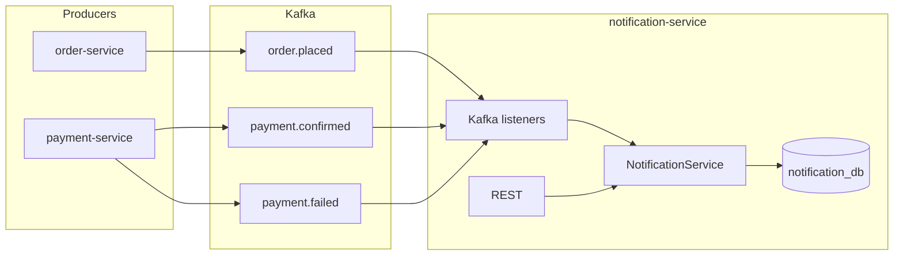

# Notification Service — Design

## Architecture

## Data model

| Column / field | Type | Notes |
|----------------|------|--------|
| `id` | BIGINT PK | Auto-increment |
| `user_id` | BIGINT | Recipient |
| `type` | VARCHAR | `ORDER_PLACED`, `PAYMENT_CONFIRMED`, `PAYMENT_FAILED` |
| `title` | VARCHAR | Short label |
| `body` | VARCHAR(2000) | Detail text |
| `order_id` | BIGINT NULL | Related order when applicable |
| `is_read` | BOOLEAN | Default false |
| `created_at` | TIMESTAMP | Set on insert |

Indexes: `user_id`, `created_at`, `read` (see `mysql_queries.sql`).

## Kafka subscription

| Topic | Event | Action |
|-------|--------|--------|
| `order.placed` | Order placed | Create `ORDER_PLACED` for `userId` |
| `payment.confirmed` | Payment confirmed | Create `PAYMENT_CONFIRMED` for `userId` |
| `payment.failed` | Payment failed | Create `PAYMENT_FAILED` for `userId` |

Deserializer settings match payment-service: JSON without type headers; DTO field names match producer payloads.

## Idempotency

Before insert, the service checks whether a row already exists for `(user_id, type, order_id)` when `order_id` is present. If present, processing is skipped (safe for at-least-once delivery).

## REST API

- `GET /api/notifications/user/{userId}?unreadOnly=` — List notifications, optional `unreadOnly=true`.
- `PATCH /api/notifications/user/{userId}/{notificationId}/read` — Mark read; returns 404 if not found or not owned by `userId`.

## Security note (MVP)

User identity is carried in the path, consistent with other backend services in this repo that do not enforce JWT inside the service. Production systems should derive `userId` from a validated token or internal trusted header.

## Deployment

- **Docker:** Multi-stage build; see `Dockerfile`.
- **Compose:** Service depends on `mysql-db` and `kafka`; port `8085`.
- **Kubernetes:** Deployment + ClusterIP service; `MYSQL_HOST=mysql`, `KAFKA_BOOTSTRAP_SERVERS=kafka:9092` (aligned with payment-service manifests).

## Testing

- `NotificationServiceApplicationTests` — Spring context load.
- `NotificationServiceImplTest` — Unit tests with Mockito for create-from-event paths, dedupe skip, and mark-as-read behavior.
