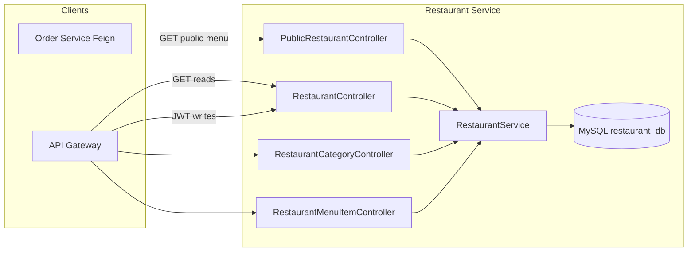

# Restaurant Service — Design

## Overview

Spring Boot 3.2 web application with JPA (MySQL), Spring Security (stateless JWT), and layered architecture: **controller → service → repository → entity**.

## API Surface

| Area | Method | Path | Auth |
|------|--------|------|------|
| Public menu | GET | `/api/public/restaurants/{restaurantId}/menu` | No |
| List restaurants | GET | `/api/restaurants` | No |
| Get restaurant | GET | `/api/restaurants/{id}` | No |
| Categories | GET | `/api/restaurants/{restaurantId}/categories` | No |
| Menu items | GET | `/api/restaurants/{restaurantId}/menu-items` | No |
| Restaurant CRUD | POST/PUT/DELETE | `/api/restaurants`, `/api/restaurants/{id}` | JWT |
| Category CRUD | POST/PUT/DELETE | `/api/restaurants/{restaurantId}/categories` … | JWT |
| Menu item CRUD | POST/PUT/DELETE | `/api/restaurants/{restaurantId}/menu-items` … | JWT |
| Availability | PATCH | `/api/restaurants/{restaurantId}/menu-items/{menuItemId}/availability` | JWT |

**Order service contract**: `GET /api/public/restaurants/{restaurantId}/menu` returns `Map<String, List<MenuItemDto>>` where the key is the **category name** and the value is all items in that category (including `isAvailable: false` so Order can reject out-of-stock selections).

## Data Model

### `restaurants`

- `id` (PK), `name`, `description`, `status` (ACTIVE/INACTIVE), `address_line1`, `city`, `cuisine_type`, `created_at`, `updated_at`.

### `categories`

- `id` (PK), `restaurant_id` (FK), `name` (unique per restaurant).

### `menu_items`

- `id` (PK), `restaurant_id` (FK), `category_id` (FK), `name`, `description`, `price`, `food_type`, `is_available`, `image_url`, `created_at`, `updated_at`.

Relationships:

- `Restaurant` 1—* `Category`  
- `Restaurant` 1—* `MenuItem`  
- `Category` 1—* `MenuItem`

Deletes cascade from restaurant to children for operational simplicity in v1.

## Security Design

- **JWT**: HS256, shared `jwt.secret` (same as Auth and API Gateway in local/docker).  
- **Filter**: `JwtAuthenticationFilter` validates Bearer token and installs `UsernamePasswordAuthenticationToken` with `ROLE_*` authorities parsed from the `roles` claim.  
- **Authorization**: Spring Security matcher order — permit `/api/public/**`, permit `GET /api/restaurants/**`, then require authentication for other `/api/restaurants/**` methods.

## DTOs and Validation

- Request DTOs use `jakarta.validation` (`@NotBlank`, `@NotNull`, `@Positive`, etc.).  
- Responses use dedicated DTOs to avoid leaking entity graphs; `MenuItemDto` field names mirror the Order service Feign client for stable JSON.

## Error Handling

- `ResourceNotFoundException` → HTTP 400/404 with JSON body via `GlobalExceptionHandler`.  
- `IllegalArgumentException` (e.g. wrong restaurant scope) → HTTP 400.

## Configuration

- `spring.datasource.*` from env: `MYSQL_HOST`, `MYSQL_PORT`, `MYSQL_USER`, `MYSQL_PASSWORD`, database `restaurant_db`.  
- `jwt.secret` from `JWT_SECRET` in containers.

## Deployment Artifacts

- **Docker**: multi-stage build (Maven package → JRE run), expose `8082`.  
- **Kubernetes**: Deployment + Service; image `vishalsharma/restaurant-service:latest` (override in cluster).  
- **SQL**: `mysql_queries.sql` for schema + seed data for local verification.
